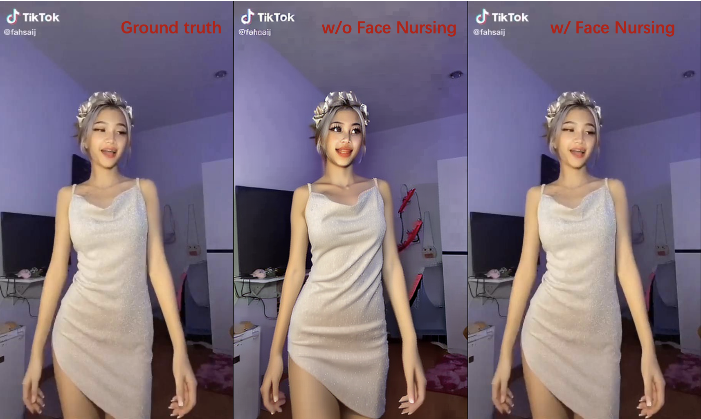
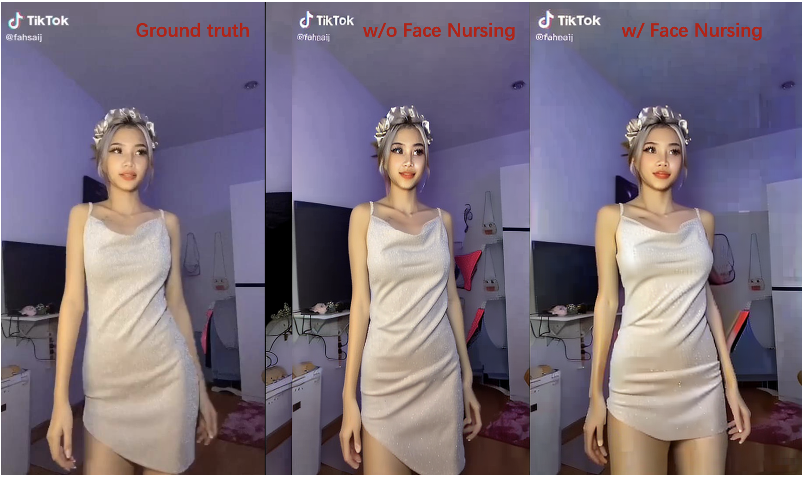
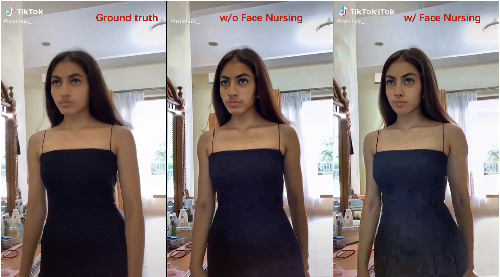
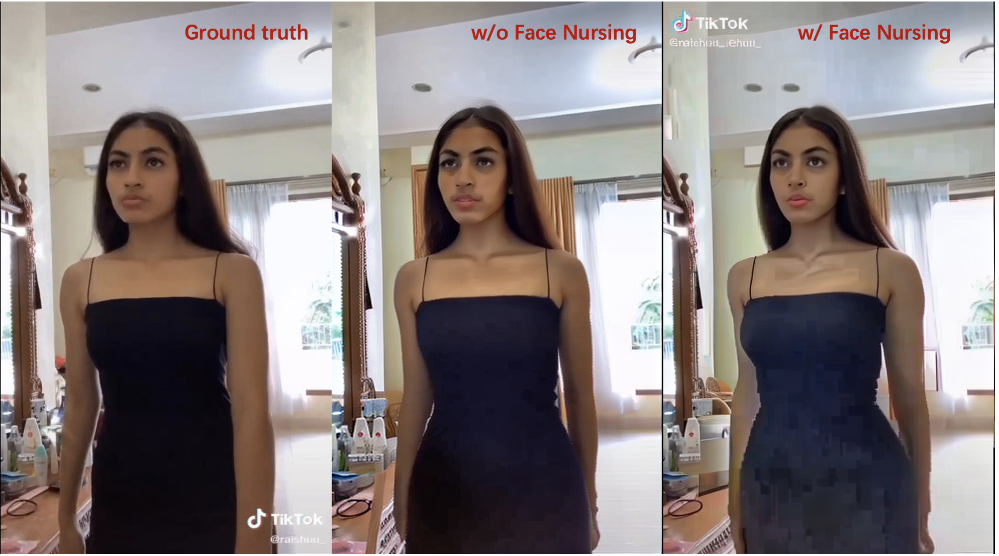
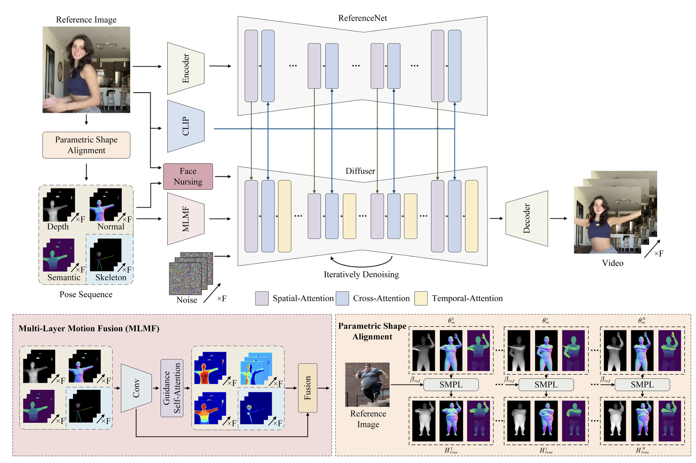
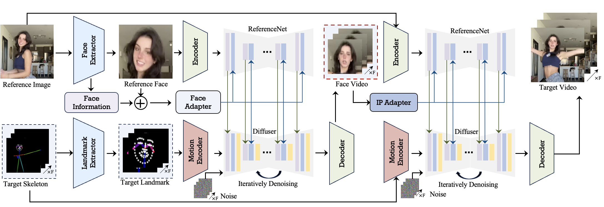

# Face Nursing for Controllable and Consistent Human Image Animation 

## Effect

The effect of face nursing on the Tiktolk dataset






## Overall Framework

This work is an extension of [champ](https://github.com/fudan-generative-vision/champ). 


## Detail of Face Nursing


## Installation

- System requirement: Ubuntu20.04/Windows 11, Cuda 12.1
- Tested GPUs: A100, RTX3090

Create conda environment:

```py
  conda create -n FaceNursing python=3.10
  conda activate FaceNursing
```

Install packages with `pip`

```py
  pip install -r requirements.txt
```

## Train the Model

To train the FaceNursing, use the following command:

```
# Run training script of stage1, train full image and face image
accelerate launch train_face_s1_addface.py --config configs/train/stage1.yaml

# Run training script of stage1.5, fine-grained guidance denoising by the target face image
accelerate launch train_face_s1.5_addface_fine.py --config configs/train/stage1.5.yaml

# Modify the `stage1_ckpt_dir` value in yaml and run training script of stage2
accelerate launch train_s2_addface_fine.py --config configs/train/stage2.yaml
```

## Conclusion

More experiment detail in [Champ](https://github.com/fudan-generative-vision/champ?tab=readme-ov-file#preparen-your-guidance-motions).
